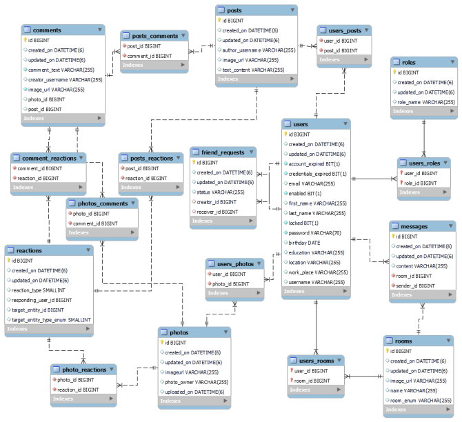
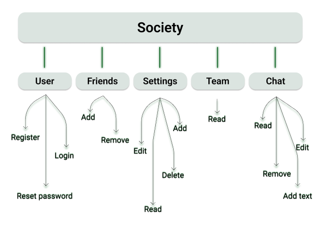

# Society Project

This is an all purpose social network practice project, maintain by a group of highly motivated young developers.
Communication is leaded with Agile Methodology with Daily Standups and Sprint of tasks.

## Tech stack
The client app is a NextJS TypeScript project, using MUI React components. 

The server application is a Java application with Spring Boot framework, Postgre database, app is dockerized.


## ER diagram:


## Local setup
```
1. In the folder /monolith/docker create .env file with values from .env.example. Contact persons of the team to have exact setup env vars. 
1.1 Run docker contrainer in folder /monolith/docker  `docker-compose up -d`
2. Start the client application
2.1 Install dependencies folder /client -> npm install
2.2 Start client in development mode folder /client -> npm run dev
```

## Action Map 


